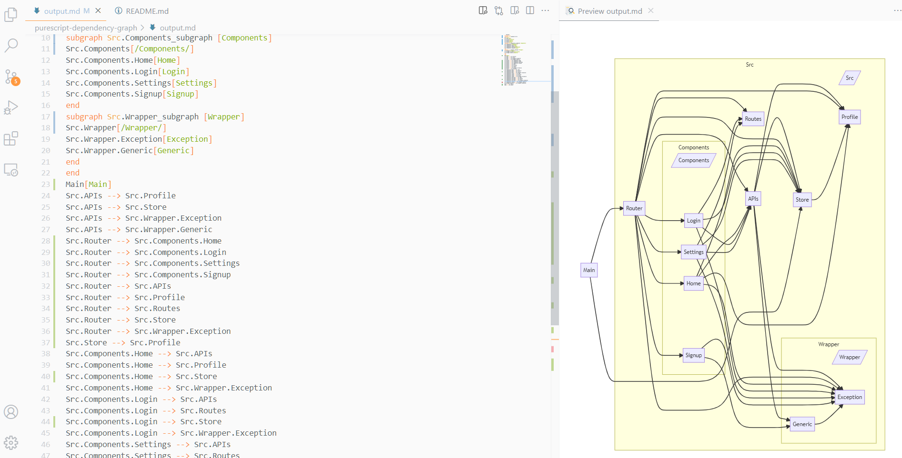

# Purescript Dependency Graph

purescriptのモジュール間の依存関係を mermaid with markdown で描画

## インストール
Releasesから最新版の VSIX ファイルをダウンロードしてください．

VSCodeの拡張機能タブのメニューから「VSIX からのインストール」を選択し，ダウンロードした VSIX ファイルを選択します．

## 使用方法

`Markdown Preview Enhanced`などのmarkdownに書かれたmermaidをレンダーできる拡張機能をインストールしてください．

ctrl + shift + P でコマンドパレットを出し，
```
>Purescript Dependency Graph: Draw Graph
```
を選択すると，以下のように出力されます．



## 設定項目

|  名称  | 初期値 |  説明  |
| ---- | ----  | ---- |
|  `sourcesDirectory`  | `"src"` |  ソースファイル(`.purs`)が位置するディレクトリを選びます．大きすぎると処理が重くなるので注意．  |
|  `outputFile`  | `"purescript-dependency-graph/output.md"` | 実行結果を出力する位置です．  |
| `selectedModules`| `".*"` | 正規表現で選ぶモジュールを絞り込めます． |
|`extension`|`"purs"`|Haskell(動作確認済み)やElm(動作未確認)のプロジェクトで使うときに変えてください．|
